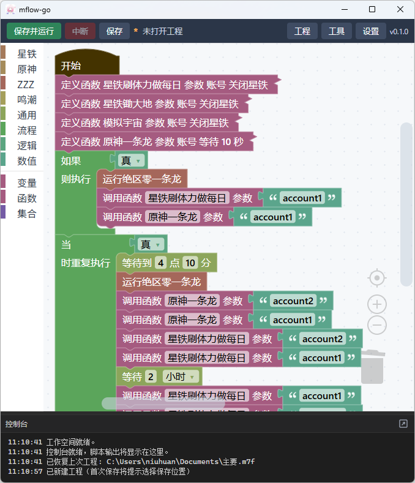

<p align="center">
    
</p>

<h1 align="center">mflow-go</h1>

<p align="center">三月七小助手、更好的原神、绝区零、鸣潮 一条龙工作流编排工具（Wails + Vue3 + Go 重写版）</p>

基于 [Blockly](https://developers.google.com/blockly) 积木编排流程，主要解决多账号、多游戏的一条龙任务编排问题。支持 崩坏：星穹铁道、原神、绝区零、鸣潮。

## 相关项目

- [三月七小助手 (March7thAssistant)](https://github.com/moesnow/March7thAssistant)
- [更好的原神 (BetterGI)](https://github.com/babalae/better-genshin-impact)
- [绝区零一条龙 (ZenlessZoneZero-OneDragon)](https://github.com/OneDragon-Anything/ZenlessZoneZero-OneDragon)
- [OK鸣潮](https://github.com/ok-oldking/ok-wuthering-waves)
- [原神自动登录工具](https://github.com/niuhuan/AutoLoginGenshin)

## 下载安装

前往 Releases 下载构建产物，解压后运行 `mflow-go.exe`。

首次启动时如果系统弹出管理员权限请求，请允许。程序需要在运行流程时管理第三方程序进程，并处理部分配置文件、注册表和自动启动场景。

## 使用说明

这个项目本身不直接代替三方工具，而是负责把多个现有工具和账号流程编排到一条工作流里。因此第一次使用前，建议先单独把依赖工具各自跑通一遍，再回到本程序中统一调度。

推荐准备以下环境：

1. 安装 [Windows Terminal](https://github.com/microsoft/terminal) 和 [PowerShell](https://github.com/powershell/powershell/releases) 7.5 以上。
2. 下载并安装三月七小助手完整版、更好的原神、绝区零一条龙完整运行时版，以及你需要接入的其他工具。
3. 分别打开这些工具，先完成首次初始化、插件下载、路径配置和一次完整运行，确认它们单独工作正常。

## 使用教程

1. 打开程序，进入「设置」，填写三月七小助手、更好的原神、绝区零一条龙、OK 鸣潮、原神自动登录器等工具的安装目录。
2. 根据各项目文档，先完成第三方工具的基础配置，例如任务结束时关闭程序和游戏、下载所需插件、设置合理超时、关闭不必要的自动更新。
3. 如果你要跑多账号流程，先在「工具」里导出账户；导入导出时会同时备份或恢复对应软件的配置文件与注册表信息。
4. 通过「工程 -> 模板」新建单账号或多账号工程，按你的实际账号名称和任务顺序调整积木。
5. 点击「运行」，程序只会执行连接在「开始」积木链路上的内容，以及需要提升的函数定义和变量定义；游离积木不会参与执行。
6. 如果你希望双击脚本后自动运行指定工程，可以使用命令行参数：

```powershell
mflow-go.exe --auto-run C:\path\to\workflow.m7p
```

也可以把这个参数配置到快捷方式、计划任务或你自己的调度脚本里，用于无人值守启动。

## 注意事项

1. 多账号场景下，导入导出账号时会同时备份和恢复各软件的配置文件。导入后如果你又修改了设置，建议重新导出一次，避免之后恢复到旧配置。
2. 若使用「更好的原神调度器」，多个配置组之间请使用空格分隔，并把「退出程序」放在最后执行，否则本程序可能会一直等待到超时。
3. 三方程序最好都单独验证过一次，包括自动启动、自动结束、异常退出后的表现。这个项目依赖进程状态判断任务是否完成，前置配置不稳定时，工作流通常也不会稳定。
4. 分支宇宙有时会出现无限循环直到超时的情况，推荐优先使用模拟宇宙。
5. OK 鸣潮在异常情况下可能不会自动退出，最终会等待到本程序设置的超时时间后再被结束。
6. 如果你希望原神账号在退登后自动登录，需要额外准备自动登录工具，并使用相同账号名导出对应账户数据，然后在流程中加入自动登录节点。

## 界面预览



## 开发

### 环境

- Go 1.25+
- Node 22、npm
- [Wails v2](https://wails.io/)（`go install github.com/wailsapp/wails/v2/cmd/wails@latest`）
- WebView2 运行时（Windows）

### 启动开发环境

```
wails dev
```

> dev 模式不会请求管理员权限；生产构建首次启动会自动请求管理员权限（第三方脚本需要 kill 进程 / 改注册表）。

### 构建

```
wails build
```

产物位于 `build/bin/mflow-go.exe`。

## 目录结构

```
mflow-go/
├── main.go / app.go          # Wails 入口与前端绑定（App 方法）
├── elevation_prod.go/_dev.go # 管理员提权（按 dev 构建标签隔离）
├── internal/
│   ├── config/               # 后端配置（%APPDATA%/opensource/mflow）
│   ├── games/                # 星铁/原神/绝区零/鸣潮 任务
│   ├── procs/                # 运行会话与进程树中断
│   ├── sysutil/              # 进程/注册表/压缩/管理员
│   └── version/              # 版本与更新检查
└── frontend/src/
    ├── blockly/              # 积木定义、生成器、工具箱、主题、模板
    ├── components/           # 工作空间、工具栏、控制台、模态框
    ├── composables/          # 运行引擎、对话框
    └── api/                  # 后端调用封装
```
